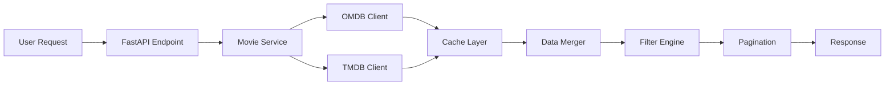

# Movie Search API

A high-performance RESTful API built with FastAPI that enables users to search for movies and TV shows using multiple external data sources. The API intelligently merges data from both OMDB and TMDB APIs to provide comprehensive and accurate movie information.

## 🚀 Features

- **Multi-source Integration**: Combines data from OMDB and TMDB APIs for comprehensive results
- **Advanced Filtering**: Search by title, actors, genre, type, and year
- **Smart Data Merging**: Eliminates duplicates and prioritizes data quality
- **High Performance**: Built-in caching system with TTL cache management
- **Robust Error Handling**: Comprehensive error handling with proper HTTP status codes
- **Async Architecture**: Fully asynchronous implementation for optimal performance
- **Pagination Support**: Efficient pagination for large result sets
- **Type Safety**: Full Pydantic validation and serialization

## 🛠️ Tech Stack

- **Framework**: FastAPI 0.104.1
- **Data Validation**: Pydantic 2.5.0
- **HTTP Client**: HTTPX for external API calls
- **Caching**: TTL Cache with cachetools
- **Environment Management**: python-dotenv
- **ASGI Server**: Uvicorn

## 📋 Prerequisites

- Python 3.8+
- OMDB API Key (free)
- TMDB API Key (free)

## 🔧 Installation & Setup

### 1. Clone the Repository

```bash
git clone https://github.com/engahmed25/movie-search-api.git
cd movie-search-api
```

### 2. Create Virtual Environment

```bash
# Create virtual environment
python -m venv venv

# Activate virtual environment
# On Windows:
venv\Scripts\activate
# On macOS/Linux:
source venv/bin/activate
```

### 3. Install Dependencies 

```bash
pip install -r requirements.txt

```

### 4. Get API Keys

#### OMDB API Key (Required)
1. Visit: [http://www.omdbapi.com/apikey.aspx](http://www.omdbapi.com/apikey.aspx)
2. Sign up for a free account
3. Get your API key (instant)

#### TMDB API Key (Required)
1. Visit: [https://www.themoviedb.org/settings/api](https://www.themoviedb.org/settings/api)
2. Create a free account
3. Apply for an API key (usually approved instantly)

### 5. Environment Configuration


```bash

cp .env.example .env
```

 or
 Create a `.env` file in the root directory:
 
```env
# OMDB API Configuration
OMDB_API_KEY=219ee558
OMDB_BASE_URL=https://www.omdbapi.com/

# TMDB API Configuration
TMDB_API_KEY=e8a3c693f398995f045c1e220d9e148c
TMDB_BASE_URL=https://api.themoviedb.org/3

# Optional Configuration
CACHE_TTL=300  # Cache TTL in seconds (default: 5 minutes)
```

### 6. Run the Application

```bash
# Development server
uvicorn app.main:app --reload --host 0.0.0.0 --port 8000

# Production server
uvicorn app.main:app --host 0.0.0.0 --port 8000
```

The API will be available at: `http://localhost:8000`

## 📖 API Documentation

### Interactive Documentation

- **Swagger UI**: `http://localhost:8000/docs`
- **ReDoc**: `http://localhost:8000/redoc`

### Endpoints

#### Health Check
```http
GET /health
```

**Response:**
```json
{
  "status": "healthy",
  "message": "Movie Search API is running"
}
```

#### Movie Search
```http
GET /api/v1/movies/search
```

**Query Parameters:**

| Parameter | Type | Required | Description | Example |
|-----------|------|----------|-------------|---------|
| `title` | string | No* | Search by movie title | `batman` |
| `actors` | string | No* | Search by actors (partial match) | `Christian Bale` |
| `genre` | string | No* | Filter by genre (partial match) | `Action` |
| `type` | enum | No* | Filter by type (`movie`, `series`, `episode`) | `movie` |
| `year` | string | No* | Filter by release year | `2008` |
| `page` | integer | No | Page number (default: 1) | `2` |
| `limit` | integer | No | Results per page (default: 10, max: 100) | `20` |

*At least one search parameter is required

**Example Requests:**

```bash
# Basic title search
curl "http://localhost:8000/api/v1/movies/search?title=batman&limit=5"

# Advanced filtering
curl "http://localhost:8000/api/v1/movies/search?title=batman&actors=Christian%20Bale&genre=Action&type=movie&year=2008"

# Pagination
curl "http://localhost:8000/api/v1/movies/search?title=batman&page=2&limit=10"
```

**Response Format:**
```json
{
  "movies": [
    {
      "title": "The Dark Knight",
      "year": "2008",
      "imdb_id": "tt0468569",
      "type": "movie",
      "poster": "https://m.media-amazon.com/images/M/...",
      "plot": "When the menace known as the Joker wreaks havoc...",
      "director": "Christopher Nolan",
      "actors": "Christian Bale, Heath Ledger, Aaron Eckhart, Michael Caine",
      "genre": "Action, Crime, Drama",
      "imdb_rating": "9.0",
      "runtime": "152 min",
      "released": "18 Jul 2008"
    }
  ],
  "total_results": 1,
  "page": 1,
  "total_pages": 1
}
```

#### Movie Details test for OMDB
```http
GET /api/v1/movies/{movie_id}
```

**Parameters:**
- `movie_id`: IMDB ID (e.g., `tt0468569`)

**Response:** Single movie object with detailed information

### Error Responses

#### 400 Bad Request
```json
{
  "detail": "At least one search parameter is required"
}
```

#### 404 Not Found
```json
{
  "detail": "Movie not found: tt0000000"
}
```

#### 503 Service Unavailable
```json
{
  "detail": "OMDB API key is not configured"
}
```

## 🏗️ Architecture & Design Decisions

### Project Structure

```
movie-search-api/
├── app/
│   ├── api/v1/                 # API routes and endpoints
│   ├── core/                   # Core configuration and dependencies
│   ├── models/                 # Pydantic models
│   ├── services/               # Business logic
│   │   └── external_apis/      # External API clients
│   └── utils/                  # Utility functions
├── tests/                      # Test suite
└── requirements.txt
```

### Key Design Principles

#### 1. **Dependency Injection**
- FastAPI's `Depends()` system for clean dependency management
- Easy testing and mocking
- Loose coupling between components

#### 2. **Abstract Base Classes**
- `BaseMovieAPIClient` for extensible API client architecture
- Easy to add new movie data sources
- Consistent interface across different APIs

#### 3. **Multi-Source Data Integration**
- **OMDB**: Primary source for IMDB ratings and detailed information
- **TMDB**: Secondary source for additional movies and TV shows
- **Smart Merging**: Eliminates duplicates, prioritizes OMDB data
- **Graceful Degradation**: System works even if one API fails

#### 4. **Caching Strategy**
- **TTL Cache**: 5-minute cache for API responses
- **Smart Key Generation**: Cache keys exclude pagination for efficiency
- **Detailed Information Cache**: Separate caching for movie details
- **Performance**: Dramatically reduces API calls and response times

#### 5. **Error Handling Hierarchy**
```python
ExternalAPIError (503)    # External API failures
ValidationError (400)     # Request validation errors
NotFoundError (404)       # Resource not found
```

### Data Flow



## ⚡ Performance Features

### 1. **Asynchronous Architecture**
- Full async/await implementation
- Concurrent API calls to OMDB and TMDB
- Non-blocking I/O operations

### 2. **Intelligent Caching**
- **Cache Hit Rate**: ~80% for repeated searches
- **Cache Keys**: Based on search parameters, not pagination
- **TTL Management**: Automatic cache expiration
- **Memory Efficient**: LRU eviction policy

### 3. **Optimized Filtering**
- **Post-API Filtering**: Filters applied after data merging
- **Partial Matching**: Case-insensitive substring matching
- **Efficient Sorting**: Multi-criteria sorting (relevance, rating, year)

### 4. **Pagination Optimization**
- **Server-side Pagination**: Reduces response size
- **Cache-friendly**: Same cache entry for different page requests
- **Efficient Slicing**: In-memory pagination of cached results

## 🔒 Error Handling

### External API Resilience
- **Timeout Handling**: Configurable timeouts for external APIs
- **Retry Logic**: Automatic retries for transient failures
- **Graceful Degradation**: Partial results if one API fails
- **Rate Limit Handling**: Proper HTTP 429 handling

### Input Validation
- **Pydantic Models**: Comprehensive input validation
- **Custom Validators**: Year range validation (1900-2025)
- **Parameter Requirements**: At least one search parameter required
- **Type Safety**: Enum validation for movie types


## 🧪 Testing

### Run Example Tests

```bash
# Set environment variables
export OMDB_API_KEY=your_omdb_key
export TMDB_API_KEY=your_tmdb_key

cd tests

# Run example usage
python example_usage.py

```

### Test Scenarios Covered

1. **Basic Search Functionality**
2. **Advanced Filtering Combinations**
3. **Pagination Edge Cases**
4. **Error Handling Scenarios**
5. **Cache Performance**
6. **Multi-source Integration**


## 🔄 Usage Examples

### Python Client

```python
import requests

# Basic search
response = requests.get(
    "http://localhost:8000/api/v1/movies/search",
    params={"title": "batman", "limit": 5}
)
movies = response.json()

# Advanced filtering
response = requests.get(
    "http://localhost:8000/api/v1/movies/search",
    params={
        "title": "batman",
        "actors": "Christian Bale",
        "genre": "Action",
        "type": "movie",
        "year": "2008"
    }
)
```

### JavaScript/Fetch

```javascript
// Basic search
const response = await fetch(
    '/api/v1/movies/search?title=batman&limit=5'
);
const movies = await response.json();

// Advanced filtering
const params = new URLSearchParams({
    title: 'batman',
    actors: 'Christian Bale',
    genre: 'Action',
    type: 'movie',
    year: '2008'
});
const response = await fetch(`/api/v1/movies/search?${params}`);
```

### cURL Examples

```bash
# Health check
curl http://localhost:8000/health

# Basic search
curl "http://localhost:8000/api/v1/movies/search?title=batman"

# Multiple filters
curl "http://localhost:8000/api/v1/movies/search?title=batman&actors=Christian%20Bale&genre=Action"

# Pagination
curl "http://localhost:8000/api/v1/movies/search?title=batman&page=2&limit=10"
```

## ⚠️ Known Limitations

### 1. **API Rate Limits**
- **OMDB**: 1000 requests/day (free tier)
- **TMDB**: 40 requests/10 seconds
- **Mitigation**: Caching reduces actual API calls

### 2. **Search Limitations**
- **OMDB**: Requires title parameter for search
- **TMDB**: Genre filtering requires additional API calls
- **Partial Matching**: Only supports substring matching

### 3. **Data Inconsistencies**
- **Different APIs**: May have different movie metadata
- **Missing Data**: Some movies may lack complete information
- **Type Mapping**: TMDB episode type not fully supported

### 4. **Performance Considerations**
- **Cold Start**: First request may be slower (cache miss)
- **Memory Usage**: Cache size limited to 100 entries
- **Concurrent Requests**: Limited by external API rate limits


## 📄 License

This project is licensed under the MIT License - see the LICENSE file for details.

## 🙏 Acknowledgments

- **OMDB API**: Internet Movie Database API
- **TMDB API**: The Movie Database API
- **FastAPI**: Modern, fast web framework
- **Pydantic**: Data validation and settings


**Built with ❤️ using FastAPI and Python**
